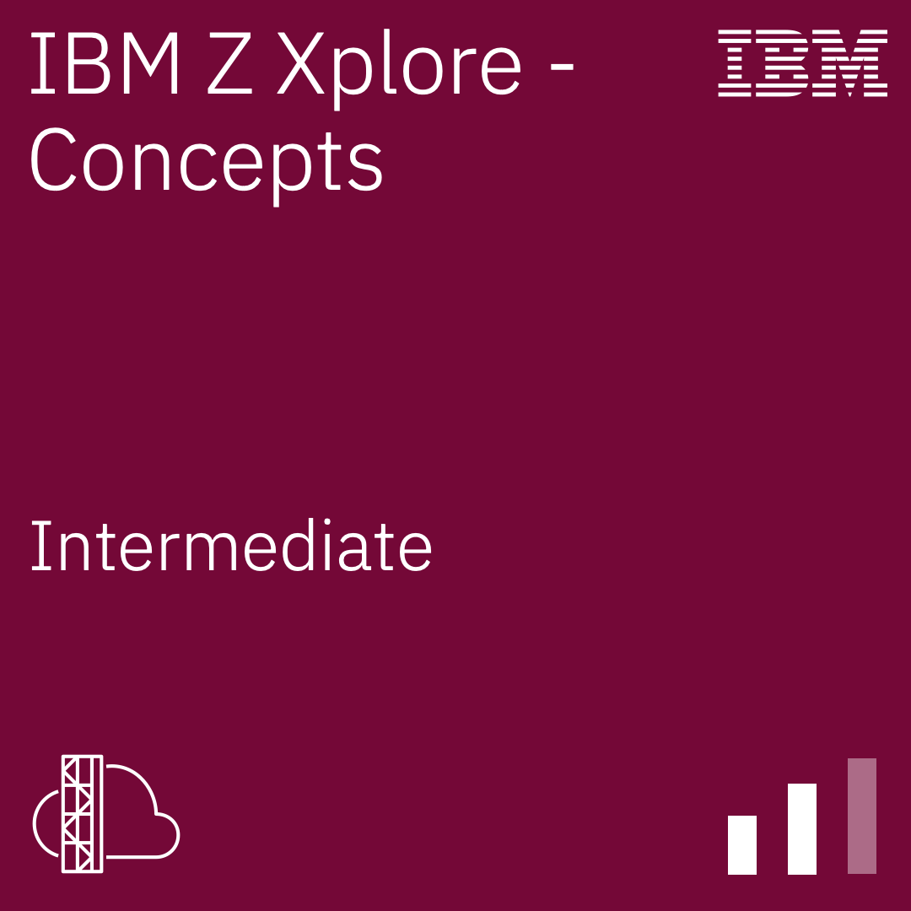
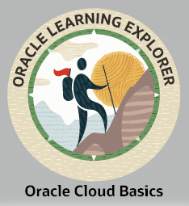

<!-- LINKS 
STACKS          https://github.com/Ileriayo/markdown-badges#badges
ICONS           https://github.com/get-icon/geticon
INONS           https://simpleicons.org/?q=git+
EMOJI           https://www.webfx.com/tools/emoji-cheat-sheet/
ESTATISTICAS    https://github.com/anuraghazra/github-readme-stats
GENERATE        https://profile-readme-generator.com/result
-->

<!-- HEADER -->

<!-- TITLE -->
<h1 align="center" alt="title">
  
    <head>    W  E  L  C  O  M  E    </head>

</h1>

---

  

  
  

###

  
  
  
  
  
  
  
  
  

###

<!-- PROFILE VIEWS -->

  

<!-- DESCRIPTION PROFILE -->
> Hello, I'm Eduardo Rosa, I'm **developer** Back-end from  Brazil
>
> 🔰 🔰 🔰 Beginning of this journey in programming: **Junho/2021** 🔰 🔰 🔰
>
> 💥 💥 💥 **Web Designer** | **Tech Writer** | **Data Analyst** | **DEV**💥 💥 💥
>
>
>
> | ♠ **TITLES**                                | ♠ **LOCAL**        | ♠ **Duration** |
> | ------------------------------------------- | ------------------ | -------------- |
> | ¹ Bachelor Engeneer Production & Automation | UNIVESP            | 5 Years        |
> | ² Bachelor Data Science                     | UNIVESP            | 4 Years        |
> | ³ Bachelor in Information Technology        | UNIVESP            | 3 Years        |
> | Mechatronics Technician                     | Centro Paula Souza | 2 Years        |
> | System Developer Technician                 | Centro Paula Souza | 1,5 Years      |

## Badges

|     |     |     |     |     |
| --- | --- | --- | --- | --- |
|  |  |  |  |  |
|   |  |  |  |   |
|   |  |

 

<!-- GIF CONNECTING -->

  
  
  
  
  
  
  

 

<!-- Habilidades Principais-->
### Main skills:
&nbsp;
&nbsp;
&nbsp;
&nbsp;

<!-- OUTROS CONHECIMENTOS -->
### Other Knowledge:
&nbsp;
&nbsp;
&nbsp;

<!-- FRAMEWORKS E BIBLIOTECAS -->
### Frameworks & Library:
&nbsp;
&nbsp;
&nbsp;
&nbsp;
&nbsp;
&nbsp;

<!-- PLATAFORMAS-->
### Tools:
&nbsp;
&nbsp;
&nbsp;
&nbsp;
&nbsp;
&nbsp;
&nbsp;
&nbsp;
&nbsp;
&nbsp;
&nbsp;
&nbsp;

<!-- BANCO DE DADOS -->
### Database:
&nbsp;
&nbsp;
&nbsp;
&nbsp;

<!-- ESTUDANDO NESSE MOMENTO -->
### Studying in this moment:
&nbsp;
&nbsp;

<!-- TÍTULOS FORMADOS -->
### Titles -> Study Completed:
&nbsp; 
&nbsp; 
&nbsp; 

---
<!-- DASHBOARDS -->

   

  <!--[Anurag's GitHub stats](https://github-readme-stats.vercel.app/api?username=RosaMaster&show_icons=true&theme=gotham)
  -->

  
  

  
  

  

---
---

<!-- MY TROPHY -->
<h2 align="left"><b>My Trophy</b></h2>
  

    
  

---
---
<!-- FOOTER -->
 

  <table>
    <tr>
      <td>
        
      </td>
      <td>
        
      </td>
      <td>
        
      </td>
      <td>
        
      </td>
    </tr>
  </table>

