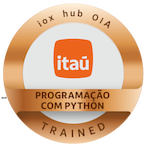

<!-- LINKS 
STACKS          https://github.com/Ileriayo/markdown-badges#badges
ICONS           https://github.com/get-icon/geticon
INONS           https://simpleicons.org/?q=git+
ESTATISTICAS    https://github.com/anuraghazra/github-readme-stats
GENERATE        https://profile-readme-generator.com/result
-->

<!-- HEADER -->

<!-- TITLE -->

  <h1 align="center" alt="title">

      <head>    W  E  L  C  O  M  E    </head>

  </h1>

<!-- DESCRIPTION PROFILE -->
### **PROFILE**

Hello, my name is __Eduardo Rosa__. I'm developer back-end from  Brazil

🔰 🔰 🔰 Beginning of this journey in programming since **Jun/2021** 🔰 🔰 🔰

💥 💥 💥 **Developer System** | **Tech Writer** | **Data Analyst** 💥 💥 💥

| ♠ **TITLES**                                | ♠ **INSTITUTION / YEAR OF GRADUATION**  |
| ------------------------------------------- | --------------------------------------- |
| ¹ Bachelor Engeneer Production e Automation | UNIVESP - `2023`                        |
| ² Bachelor Information Technology           | UNIVESP - `2025`                        |
| ³ Bachelor Data Science                     | UNIVESP - `2026`                        |
| Mechatronics Technician                     | Centro Paula Souza - `2011`             |
| System Developer Technician                 | Centro Paula Souza - `2022`             |

### **INDEX**

- [**BADGES**](#-badges)
- [**KEY SKILLS**](#️-key-skills)
- [**AWS SERVICES**](#️-aws-services)
- [**LANGUAGES AND TOOLS**](#-languages-and-tools)
- [**DATABASES**](#-databases)
- [**FRAMEWORKS, PLATFORMS AND LIBRARIES**](#-frameworks-platforms-and-libraries)
- [**IDES/EDITORS**](#-ideseditors)
- [**SOCIAL**](#-social)

 

### **🌀 BADGES**

|     |     |     |     |     |     |
| --- | --- | --- | --- | --- | --- |
|  |  |  |  |  |  |
|  |  |   |  |  |

 

<!-- Habilidades Principais -->
### **🗝️ KEY SKILLS:**

&nbsp;
&nbsp;
&nbsp;

### **☁️ AWS SERVICES:**

&nbsp;
&nbsp;
&nbsp;
&nbsp;
&nbsp;
&nbsp;
&nbsp;
&nbsp;
&nbsp;
&nbsp;
&nbsp;
&nbsp;

<!-- Linguagens e outras ferramentas -->
### **📋 LANGUAGES AND TOOLS:**

&nbsp;
&nbsp;
&nbsp;
&nbsp;
&nbsp;
&nbsp;
&nbsp;
&nbsp;
&nbsp;

<!-- BANCO DE DADOS -->
### **💾 DATABASES:**

&nbsp;
&nbsp;
&nbsp;
&nbsp;

<!-- FRAMEWORKS E BIBLIOTECAS -->
### **📚 FRAMEWORKS, PLATFORMS AND LIBRARIES:**

&nbsp;
&nbsp;
&nbsp;
&nbsp;
&nbsp;
&nbsp;

<!-- IDEs -->
### **💻 IDES/EDITORS:**

&nbsp;
&nbsp;
&nbsp;
&nbsp;
&nbsp;
&nbsp;
&nbsp;

&nbsp;
&nbsp;
&nbsp;
&nbsp;
&nbsp;
&nbsp;

---
<!-- FOOTER -->
### **⚡ SOCIAL:**

  <table>
    <tr>
      <td>
        
      </td>
      <td>
        
      </td>
      <td>
        
      </td>
    </tr>
  </table>

---

⤴️ [**HOME PAGE**](#profile)
